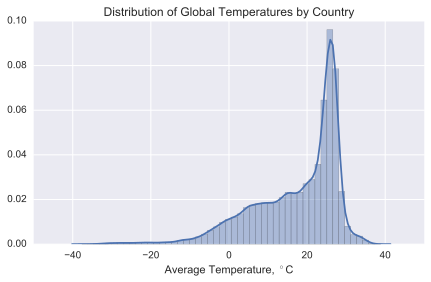

# Final
The purpose of this assignment was to perform 5 analyses on a readily downloadable dataset. I chose to look into global temperature patterns and what might be the causes of those patterns.

## Analysis 1
To start, I wanted to understand the dataset a bit more. First, I calculated the average temperature of the dataset of country temperature data. According to that dataset, the average temperature of the globe is 17.5 C. I then created a histogram of the country temperature dataset to get a feel for the distribution of temperatures aound the world. That histogram is below.

It shows us what the and answer a few simple questions like 'What is the hotest country in the world?'. I started broad and separated the 

Is this even changing?

## Addtional Instructions to Run Code
### Data
The main source of my data was too large to upload to Github, so you will need to download it from Kaggle, [here](https://www.kaggle.com/berkeleyearth/climate-change-earth-surface-temperature-data). You will need to set up an account with Kaggle, but it is free.

### Additional Library
I used the basemap library from matplotlib, documentation can be found [here](https://matplotlib.org/basemap/). To install, simply execute `$conda install basemap` in your terminal.

