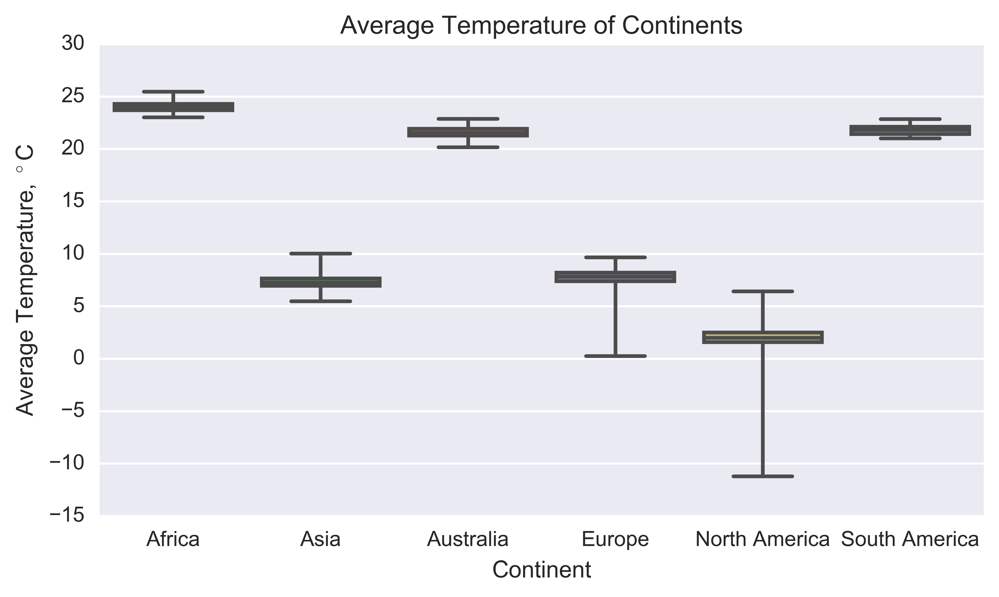

# Final
The purpose of this assignment was to perform 5 analyses on a readily downloadable dataset. I chose to look into global temperature patterns and what might be the causes of those patterns.

## Analysis 1
To start, I wanted to understand the dataset a bit more. First, I calculated the average temperature of the dataset of country temperature data. According to that dataset, the average temperature of the globe is 17.5 C. I then created a histogram of the country temperature dataset to get a feel for the distribution of temperatures aound the world. That histogram is below.

Next I wanted to answer a few simple questions like 'What are the hottest/coldest countries in the world?'. I started broad and separated cities into quadrants of the globe (North West, South West, North East, and South East.

From there I narrowed the categorization into continents and wanted to see the average temperature of each continent and how much the temperature varied; I used a boxplot to show that data. 

Overall I was surprised by how little the data for each continent varied on average, but how great the range of temperatures was for some continents like North America.

Next I narrowed to a country level of focus to find the top five hottest and coldest countries in the world. The top five hottest countries in the world are Aruba(27.92C), Senegal( 27.96C), Burkina Faso(28.07C), Mali(28.44C), and Djibouti(28.82C). The variation across the top five hottest countries is only 0.90C.

The top five coldest countries in the world are Canada(-5.33C), Russia(-5.58C), Svalbard And Jan Mayen(-7.44C), Denmark(-18.05C), and Greenland(-18.58C). The variatio of the top five coldest countries is 13.25C.

Finally I went to a city level of granularity to find the top five hottest/coldest cities in the world. The hottest cities in the world are Kassala(28.92C), Niamey(29.04C), Umm Duran(29.06C), Khartoum(29.06C), and Jibuti(29.16C). The variation between the top five hottest countries is only 0.24C.

The coldest cities in th world are Surgut(-3.53C), Ust Ilimsk(-4.00C), Chita(-4.36C), Kyzyl(-6.22C), and Norilsk(-11.84C). At 8.31C, the variation betweent the top five coldest countries is a bit more than the hottest countires. Overall it would seem the hotter countries and cities don't vary in temperature as much, which could have something to do with their location; especially their distance from the equator. Generally, the close to the equator the the country is, the more regular (and hotter) the temperatures will be. To get an idea of how the cities of the dataset are distributed, see the plot below.

## Addtional Instructions to Run Code
### Data
The main source of my data was too large to upload to Github, so you will need to download it from Kaggle, [here](https://www.kaggle.com/berkeleyearth/climate-change-earth-surface-temperature-data). You will need to set up an account with Kaggle, but it is free.

### Additional Library
I used the basemap library from matplotlib, documentation can be found [here](https://matplotlib.org/basemap/). To install, simply execute `$conda install basemap` in your terminal.

