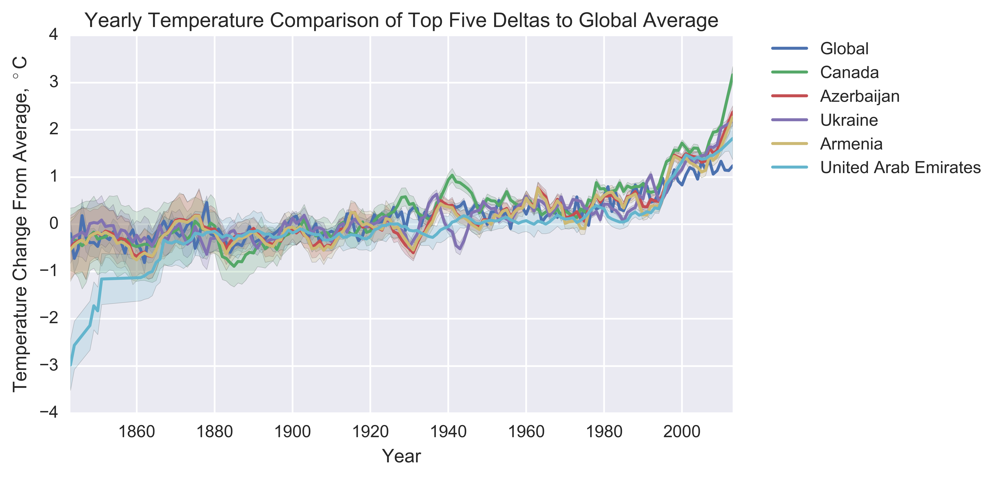
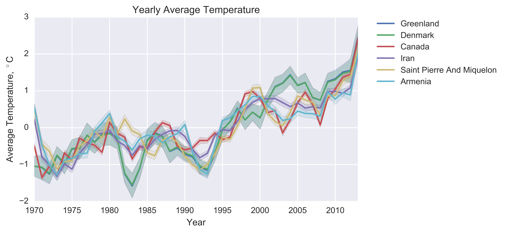
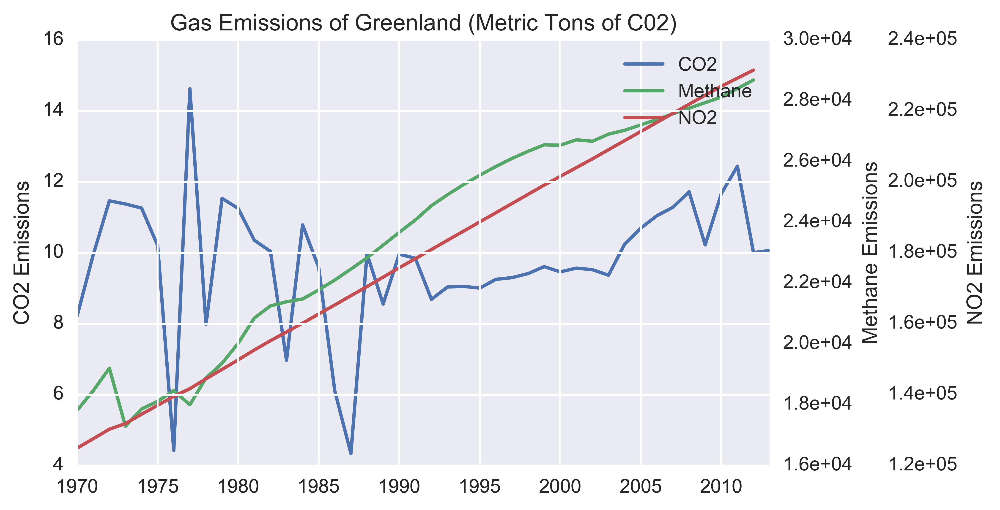
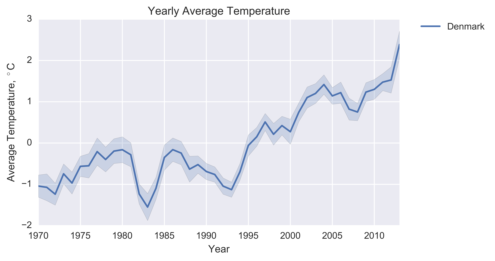
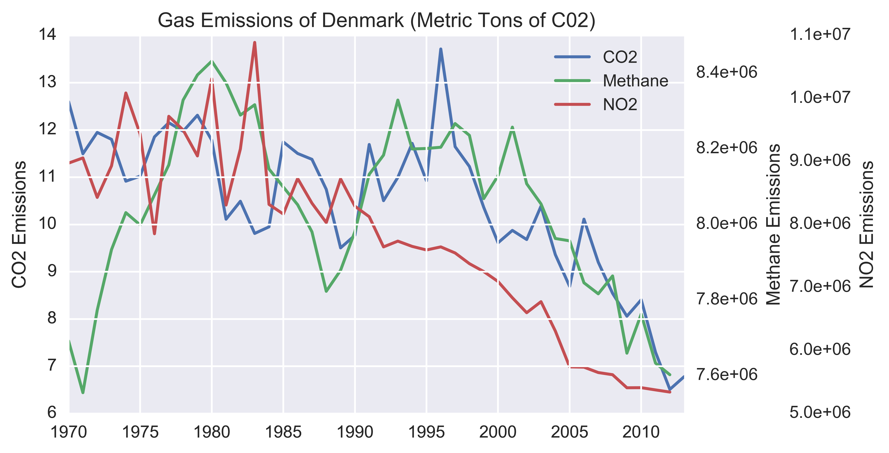
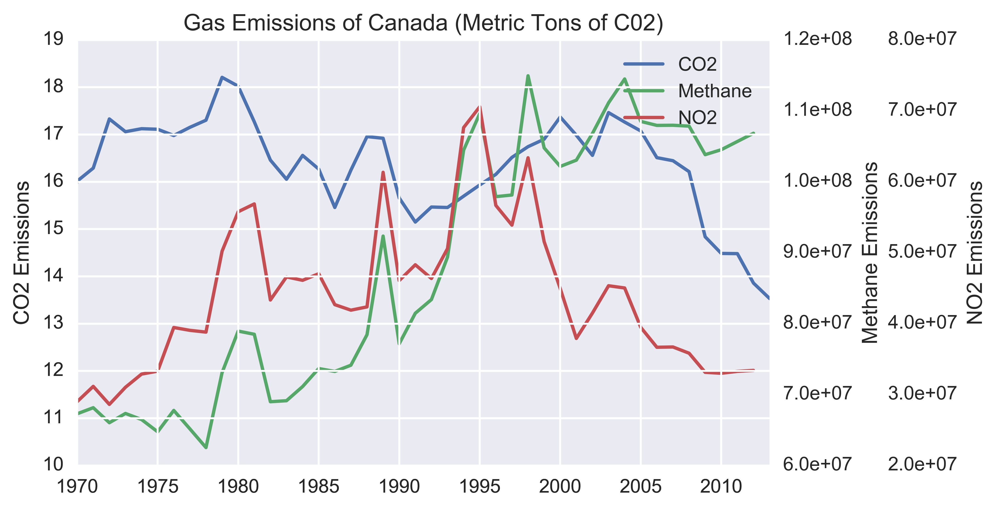
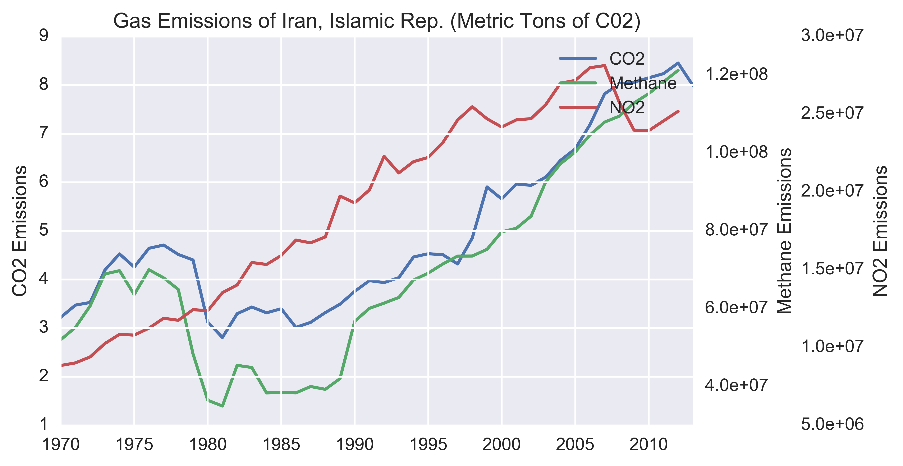
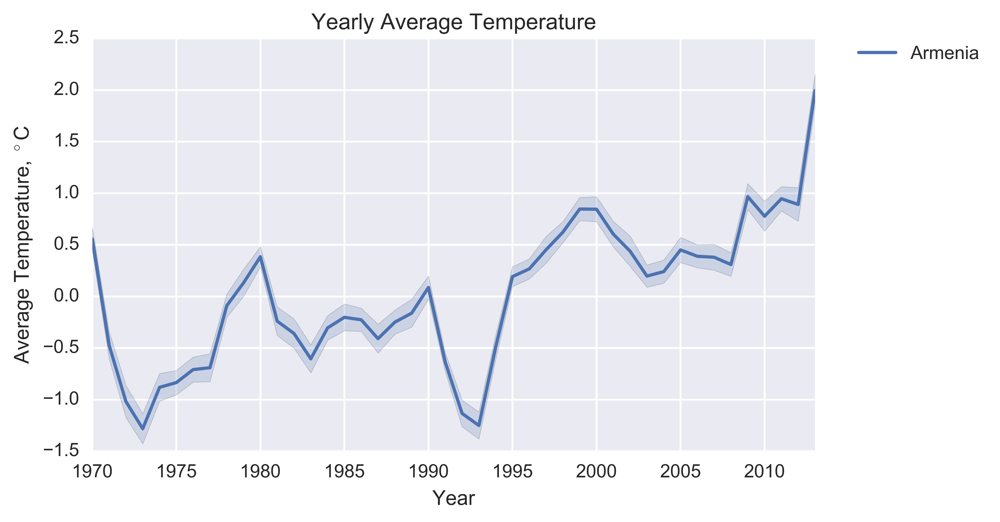

# Final
The purpose of this assignment was to perform 5 analyses on a readily downloadable dataset. With global warming being such a hot topic lately, I chose to look into global temperature patterns and what might be the causes of those patterns.

## Analysis 1: Hot vs Cod
To start, I wanted to understand the dataset a bit more. First, I calculated the average temperature of the dataset of country temperature data. According to that dataset, the average temperature of the globe is 17.5&deg;C. I then created a histogram of the country temperature dataset to get a feel for the distribution of temperatures aound the world. That histogram is below.

### Quadrants of the Globe
Next I wanted to answer a few simple questions like 'What are the hottest/coldest countries in the world?'. I started broad and separated cities into quadrants of the globe (North West, South West, North East, and South East.

### Continents
From there I narrowed the categorization into continents and wanted to see the average temperature of each continent and how much the temperature varied; I used a boxplot to show that data. 

Overall I was surprised by how little the data for each continent varied on average, but how great the range of temperatures was for some continents like North America.

### Countries
Next I narrowed to a country level of focus to find the top five hottest and coldest countries in the world. The top five hottest countries in the world are Aruba(27.92&deg;C), Senegal( 27.96&deg;C), Burkina Faso(28.07&deg;C), Mali(28.44&deg;C), and Djibouti(28.82&deg;C). The variation across the top five hottest countries is only 0.90&deg;C.

The top five coldest countries in the world are Canada(-5.33&deg;C), Russia(-5.58&deg;C), Svalbard And Jan Mayen(-7.44&deg;C), Denmark(-18.05&deg;C), and Greenland(-18.58&deg;C). The variatio of the top five coldest countries is 13.25&deg;C.

### Cities
Finally I went to a city level of granularity to find the top five hottest/coldest cities in the world. The hottest cities in the world are Kassala(28.92&deg;C), Niamey(29.04&deg;C), Umm Duran(29.06&deg;C), Khartoum(29.06&deg;C), and Jibuti(29.16&deg;C). The variation between the top five hottest countries is only 0.24&deg;C.

The coldest cities in th world are Surgut(-3.53&deg;C), Ust Ilimsk(-4.00&deg;C), Chita(-4.36&deg;C), Kyzyl(-6.22&deg;C), and Norilsk(-11.84&deg;C). At 8.31&deg;C, the variation betweent the top five coldest countries is a bit more than the hottest countires. 

Overall it would seem the hotter countries and cities don't vary in temperature as much, which could have something to do with their location; especially their distance from the equator. Generally, the close to the equator the the country is, the more regular (and hotter) the temperatures will be. To get an idea of how the cities of the dataset are distributed, see the plot below.

## Analysis 2: Largest Temperature Delta

For the next analysis I wanted to determine which countries had the greatest temperature delta from the beginning of data collection until now. The time range I had to work with was from 1750 to 2013. However, as I began comapring values, there was an issue. The recorded temperatures from the earlier end of the data were sporadic and the uncertainty was too high. To see what I mean, see the plot of the global temperature average pre year below. The dark line is the global average while the shaded region is the uncertainty of the temperature.

As you can see, the temperature recordings are all over the place until it stabalizes a bit between 1850 and 1900. To view the uncertainly levels in more detail, I plotted them below.

The global average uncertainty level begins to stabalize just before 1850. I decided to use 1850 as a cut-off date to use as much data possible while only using viable data. There are a few outliers in uncertainty after 1850, so I also removed any datapoints with an uncertainty greater than 1.5. I chose 1.5 because that is the value at which the uncertaintly stabalizes around by 1850.

Once I had a more reliable set of data, I calculated the delta of average temperature change between 1850 and 2013. I was looking for an overal trend and due to the possible variation from year to year, I chose to use a 5 year average for the end points. The top five ten countires with the largest delta can be seen below. The plot of all countries deltas was too large for this markdown and can be viewed [here](analysis/ana_2/alldiffsPlot.png) if you'd like to.

Next I wanted to get an idea of what the distribution of deltas was across the globe and so I plotted that below.

Finally I wanted to see how the countries with the highest deltas compared to the global average and so I plotted them together. Plotting all ten would have been too much for one graph, so I only plotted the top five and averaged around 0&deg;C.

They all tend to follow the same trend, although I would need to look further into the UAE data to determine if the rapid change in temperature from 1850 to 1880 is valid or representative of their data collection system at the time. Alsmost all countires seem to begin to stray from the average and climb around 1990. It would be interesting to look closer at what changes happened in those countries around taht time. Another observation is the temperature changes between 1920 and 1950. All but the UAE seem to have large temperature changes in that time span, but not necessarily in the same direction.

## Analysis 3: Rate of Change
For this next analysis, I wanted to look at the rate of temperature change of each country over 3 year spans to determine if there were any spcefic events that drastically changed the temperature of a country. Again, due to data inconsistencies, I used the same time cut-off of 1850. The top ten temperature events were held by six different countries as can be seen in the bar graph below.

| Country     | Year | Temperature Change (&deg;C)| 
| ----------- |:----:|:------------------:|
|Saudi Arabia |1859  |9.31                |
|Saudi Arabia |1856  |-9.19               |
|Mauritania   |1853  |-7.13               |
|Mauritania   |1856  |6.91                |
|India        |1867  |5.24                |
|India        |1862  |-5.01               |
|Vietnam      |1865  |4.55                |
|Finland      |1941  |-4.53               |
|Vietnam      |1862  |-4.46               |
|Laos         |1865  |4.32                |

For the countries that have two events of about the same temperature change, they could either be an outlier measurement or some sort of event. However, if you look at the years when they happened, some events are around the same time period. I graphed the temperature records for each country that had an event around the same time. Six of the top ten unique countries had events in a similar time frame.

You can clearly see a severe dip in temperature from Saudi Arabia nd Mauritania around the same time. However Mauritania dips in 1853 and rebounds in 1856 while Saudi Arabia dips in 1856 and rebounds in 1859. These events may not be related and could simply be a measurement error. Both countries measurements start close to that date, which would also point toward a potential measurement error.

India, Vietnam, Laos, and Burma, however, all have a dip between 1862 and 1865. This makes me think it is less of a measurement error and more of an event that caused a drastic dip in temperature. This would definitely warrant further investigation.

The remaining four of the top ten countries with events in similar time frames are graphed below.

These four countries follow a very similar temperature profile and one can clearly see a severe dip in temperature between 1941 and 1944. As before, seeing as this dip is displayed in all four countries, I'm inclined to think this is a true measurement and it would be interesting to investigate the cause. Beside that sigle event, the overall average temperature profile of these four countires seems to vary year to year more than the six from the other comparison. This follows what we saw in the first analysis with the colder climates varying more than the warmer climates. 

## Analysis 4: Effect of Gases on Temperature

After looking at different trends and event in global termperatures, I wanted to investigate a cause. The most mentioned in global warming are CO2 and other greenhouse gases. I decided to compare the emissions of CO2, NO2, and methane to the change in temperature between 1970 and 2013; the emissions data I found starts at 1970. Below are the top ten countries of that delta.

To get an idea of what their temperature profiles look like during that time period, I graphed the top six below. I used the top six, because one of the top five, Saint Pierre and Miquelon, doesn't have any gas emissions data in the dataset I used.

The general trend is that the temperature is rising, but something to note is that Greenland and Denmark have nearly identical temperature patterns. This could be due to Greenland being a colony of Denmark's and so linking the two countries data together. 

### Greenland
I can't discern much by comparing the two graphs other than the temperature, methane, and NO2 all have the same upward trend.

### Denmark
Denmark's emissions seem to be on the descent and much lower than they were in 1970 despite the rise in temperature. 

### Canada

### Iran
Iran has a surprisingly steady increase in all gas emissions.

### Armenia
Armenia has had an agressive increase in both CO2 and NO2 since the mid nineties. The sudden drop in all three gases in the early nineties may corelate to the dip in temperature around that same time.

## Analysis 5: 
For my final analysis, I wanted to look at the gas corelation a different way. Rater than start with the largest raises in temperature over a period of time, I looked at the rate of change, over a five year period, in total gas emissions to see if there were trends in those countries' temperatures that were more apparent. The top 16 changes in total emmisions were either in Indonesia or China and in the top 50 instances, 23 were China and 16 were Indonesia. For the sake of comparison, I've plotted the maximum changes of the top ten unique countries.

I then wanted to see what the top five countries emissions profiles looked like.

Indonesia's change in total emissions is far more sparadic than China's, but the rate of increase for China is far greater. Comparing the change in temperature to the total emissions...

Looking at the graph comparing China's increase in temperature to its total emissions shows a general corelation of slope increase other than the span of 2005 to 2011. However, the rapid jump in 2013 brought the corelation back to normal. The peaks of emissions do seem to preceed some of the peaks in temperature change, so there could be something there.

Indonesia's plot seems to show more corelation between Indonesia's emissions and its gas emissions. The paks of both generally fallow the same pattern and the CO2 preceeds the rise in temeratures as you'd expect. There is not a direct corelation, however, which suggests there is more that needs to be taken into account than just the level of emissions. Indonesia's total emissions rate is also much more chaotic than China's and it'd be interesting to understand why.

Overall, it's too difficult to discern any real connection between the graphs at this level of granularit. I think moving to a more regional view would be better

## Addtional Instructions to Run Code
### Data
The main source of my data was too large to upload to Github, so you will need to download it from Kaggle, [here](https://www.kaggle.com/berkeleyearth/climate-change-earth-surface-temperature-data). You will need to set up an account with Kaggle, but it is free.

### Additional Library
I used the basemap library from matplotlib, documentation can be found [here](https://matplotlib.org/basemap/). To install, simply execute `$conda install basemap` in your terminal.

## Extra
Out of curiosity, I wanted to know which countries had the greatest rise in total emissions since 1970 and so I plotted those below.

As you can see, China has had a staggering increase in emissions over 43 years and shows no signs of stopping. 

I also wanted to see which countries were currently producing the most greenhouse gases around the world. You can find a graph of all emissions [here](topEmissions) and the total emissions of the top five contributors since 1970, below.

