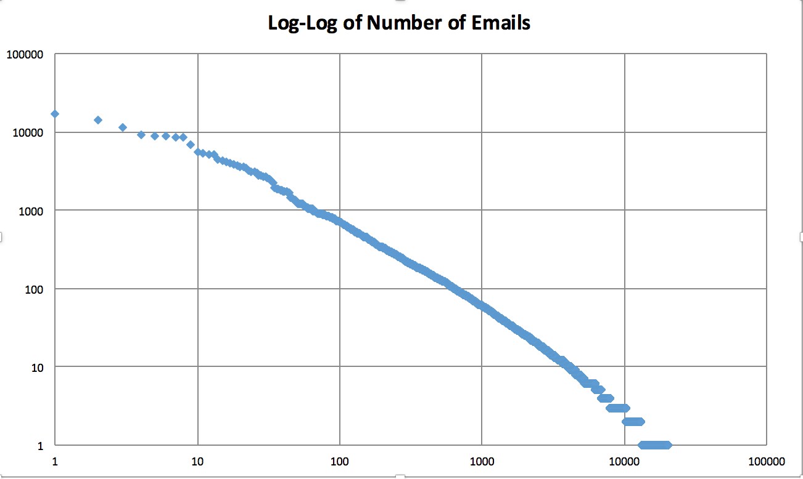

# Question 1

## Analysis 1
- To start I wanted to see who emailed the most and who the top few emailers were. The results of this can be found under que1/ana_1/emails.csv. The top three were Kay Mann, Vince Kaminski, and Jeff Dasovich with 16,735, 14,368, and 11,411 respectively. Vince Kaminski was the Director of Research at Enron, so I'm surprised by the number of emails he sent. It'll be interesting to see how many the CEO has.
- Interestingly, there is a linear coorelation of the log-log of the number of emails sent, as can be seen below.

## Analysis 2
- For this analysis I focused on any emails that contained "Andersen" in them as Arthur Andersen was Enron's legal coucil. I combed through all data and pulled any emails that contained the word 'Andersen' in them; there were 436 of them.
- From there, I wanted to look at what the date distribution was, so I plotted the number of emails with 'Anderson' per day. You can find the csv under que1/ana_2/AndersenDates.csv

## Analysis 3
- For this analyis I wanted to see how often the two CEO's and CFO emailed each other and in general. I started off with analyzing how many times they emailed overal. It turns out, they do not email people very often. This can be seen in the que1/ana_3 folder under KLay_Email_Frequency and JSkilling_Email_Frequency. The CFO, Andrew Fastow doesn't have his email folder in this data so I couldn't run this analysis. 
- Next I wanted to see how often the three gentlemen emailed each other. Unfortunately due to the little they email in generl, this did not produce the results I was hoping for. Kenneth Lay and Andrew Fastow emailed each othe only twice (emails located under que1/ana_3 in Lay_Fastow_Emails.csv), Andrew Fastow and Jeff Skilling emailed each other five times (emails located under ana_1 in Fastow_Skilling_Emails.csv. And supposedly Lay and Skilling never emailed each other. This seems suspicious considering they were the two CEO's during the scandal.

# Question 2
## Analysis 1
- For this analysis, I wanted to see who the top authors of 2016 were. I loaded the archived data from last year and tallied the number of times an author published an article. The results can be found in que2/ana_1/authors.csv. The top five are The Associated Press (2656), The Editorial Board (1057), The New York Times (1057), International Herald Tribune (538), and Deb Amlem (416). I did a log-log analysis of the information, and there's not much of a correlation.

## Analysis 2
- For this analysis, I wanted to see if there was a trend last year in the number of articles per category per day. The csv can be found in que2/ana_2/articleDay.csv. The problem arose when I tried to graph that much information at once. I decided to summarize it to articles per category per month (que2/ana_2/articleMonth.csv), but again, it was too much to graph at one time. I decided to broaden it even further to just number of articles per month which can be seen below.

## Analysis 3
- Fo this analysis I used the Article Serach API. I wanted to see which words were most common around the election time for the past seven elections. You can see the output in que2/ana_3/politicalWords.csv

